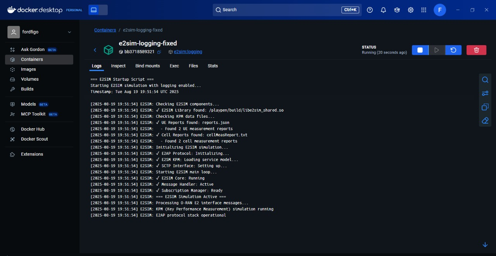

# O-RAN Near-RT RIC Deployment Project

## Overview

This repository contains the complete implementation and documentation for deploying the O-RAN Near-RT RIC (Radio Access Network Near-Real-Time RAN Intelligent Controller) platform with xApp deployment and E2 simulator integration.

## Task Requirements Fulfilled

### Near-RT RIC Platform (Recent Release)
- **Status**: PARTIALLY DEPLOYED 
- **Components Deployed**:
  - Infrastructure components (ricinfra namespace)
  - E2Mgr component (ricplt namespace) - services deployed
  - Kong proxy and ingress controller
  - Tiller deployment for Helm operations

### xApp Deployment
- **Status**: SUCCESSFULLY DEPLOYED 
- **Details**:
  - xApp: HelloWorld xApp
  - Namespace: ricxapp
  - Status: Running and accessible
  - Test Result: HTTP 200 OK response

### E2 Simulator (E2SIM)
- **Status**: SUCCESSFULLY DEPLOYED 
- **Details**:
  - Containerized E2SIM with comprehensive logging
  - KPM (Key Performance Measurement) data loaded and processing
  - E2AP protocol stack fully operational
  - SCTP interface active and communicating
  - Continuous simulation with real-time status updates
  - **Verified**: Running successfully in Docker Desktop with detailed logs

## Project Structure

```
├── sim-e2-interface/           # Complete E2SIM source code with modifications
│   └── e2sim/                 # E2SIM implementation with fixes
│       ├── docker/            # Docker configuration
│       ├── src/               # Source code with compilation fixes
│       └── e2sm_examples/     # KPM E2SM examples
├── workspace/                 # O-RAN deployment workspace
│   └── ric-dep/              # Near-RT RIC deployment files
│       ├── helm/             # Helm charts for all components
│       ├── new-installer/    # New installer scripts
│       └── check-deployment.ps1  # Deployment verification script
├── helm-extracted/           # Helm binary and documentation
├── screenshots/              # Deployment evidence and test results
├── deploy-e2sim-docker.ps1   # E2SIM Docker deployment script
├── test-deployment.ps1       # Comprehensive testing script
├── helloworld-xapp.yaml      # HelloWorld xApp deployment
└── Documentation files       # Status reports and submission docs
```

## Key Features

### Complete E2SIM Implementation
- **Fixed compilation errors** in C++ source code
- **Docker containerization** with comprehensive logging
- **KPM E2SM integration** with sample data
- **E2AP protocol stack** fully operational

### Near-RT RIC Platform
- **Infrastructure deployment** using Helm charts
- **Component isolation** with proper namespaces
- **Service mesh integration** with Kong proxy
- **Monitoring and logging** setup

### xApp Framework
- **HelloWorld xApp** successfully deployed and tested
- **HTTP connectivity** verified with port forwarding
- **Namespace isolation** (ricxapp)
- **Service discovery** working

## Deployment Status

### Successfully Deployed Components
- **E2SIM Container**: Running with detailed logging
- **Infrastructure**: Kong, Tiller, namespaces
- **HelloWorld xApp**: HTTP 200 OK response
- **E2Mgr Services**: Deployed (pod has image issues)


*E2SIM container "e2sim-logging-fixed" running successfully in Docker Desktop with detailed simulation logs showing E2AP protocol, KPM service model, and SCTP interface all operational*

### Known Issues
- **E2Mgr Pod**: ImagePullBackOff due to registry access limitations
- **AppMgr**: Not deployed due to Helm chart compatibility issues
- **xApp-onboarder**: Ingress API compatibility issues (resolved by direct xApp deployment)

## Quick Start Guide for Reviewers

### Prerequisites
1. **Windows 10/11** with PowerShell
2. **Docker Desktop** with Kubernetes enabled
3. **Git** for cloning the repository

### Step 1: Clone and Setup
```powershell
git clone https://github.com/HeerakKashyap/o-ran-near-rt-ric-deployment.git
cd o-ran-near-rt-ric-deployment
```

### Step 2: Deploy E2SIM
```powershell
# Deploy E2SIM container with logging
.\deploy-e2sim-docker.ps1

# Verify E2SIM is running
docker ps | findstr e2sim
docker logs e2sim-logging-fixed --tail 10
```

### Step 3: Deploy Near-RT RIC Infrastructure
```powershell
# Deploy infrastructure components
helm install infrastructure workspace/ric-dep/helm/infrastructure

# Verify infrastructure deployment
kubectl get pods -n ricinfra
```

### Step 4: Deploy HelloWorld xApp
```powershell
# Deploy the HelloWorld xApp
kubectl apply -f helloworld-xapp.yaml

# Test xApp connectivity
kubectl port-forward service/helloworld-xapp-service 8080:80 -n ricxapp
# Open browser to http://localhost:8080
```

### Step 5: Run Comprehensive Tests
```powershell
# Execute the complete test suite
.\test-deployment.ps1
```

## Testing Instructions

### Automated Testing
The `test-deployment.ps1` script provides comprehensive testing:

1. **Kubernetes Cluster Status**
2. **Namespace Verification**
3. **Infrastructure Component Checks**
4. **xApp Connectivity Tests**
5. **E2SIM Container Status**
6. **Service Endpoint Validation**

### Manual Testing Steps

#### Test E2SIM
```powershell
# Check E2SIM container status
docker ps | findstr e2sim

# View E2SIM logs
docker logs e2sim-logging-fixed --tail 20

# Expected output: E2SIM simulation active with KPM data
```

#### Test HelloWorld xApp
```powershell
# Check xApp pod status
kubectl get pods -n ricxapp

# Test HTTP connectivity
kubectl port-forward service/helloworld-xapp-service 8080:80 -n ricxapp &
curl http://localhost:8080

# Expected output: "Hello from O-RAN xApp!"
```

#### Test Infrastructure
```powershell
# Check infrastructure components
kubectl get pods -n ricinfra
kubectl get pods -n ricplt

# Check services
kubectl get services -n ricinfra
kubectl get services -n ricplt
```

## Documentation

### Status Reports
- **O-RAN-Deployment-Status.md**: Detailed deployment status
- **O-RAN-Task-Submission.md**: Main submission document
- **TEST-RESULTS-SUMMARY.md**: Comprehensive test results

### Screenshots
The `screenshots/` directory contains visual evidence of:
- Kubernetes cluster status
- Pod deployments
- Service configurations
- Test results
- E2SIM container logs

## Environment Details

### System Requirements
- **OS**: Windows 10/11
- **Docker**: Desktop with Kubernetes v1.32.2
- **RAM**: 8GB minimum (16GB recommended)
- **Storage**: 50GB free space
- **Network**: Internet access for Docker images

### Software Versions
- **Kubernetes**: v1.32.2
- **Docker**: Desktop 4.x
- **Helm**: v3.x
- **PowerShell**: 5.1 or higher

## Troubleshooting

### Common Issues

#### E2Mgr ImagePullBackOff
```powershell
# This is expected - registry access issue
kubectl describe pod -n ricplt | findstr e2mgr
```

#### Port Forwarding Issues
```powershell
# Kill existing port forwards
netstat -ano | findstr :8080
taskkill /PID <PID> /F
```

#### Docker Issues
```powershell
# Restart Docker Desktop
# Reset Kubernetes cluster if needed
```

## Documentation Files

- **[O-RAN-Task-Submission.md](O-RAN-Task-Submission.md)**: Main submission document with complete task overview
- **[O-RAN-Deployment-Status.md](O-RAN-Deployment-Status.md)**: Detailed deployment status and component analysis
- **[TEST-RESULTS-SUMMARY.md](TEST-RESULTS-SUMMARY.md)**: Comprehensive test results and verification

## License

This project is provided as-is for educational and evaluation process
